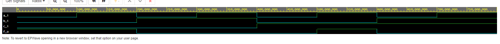
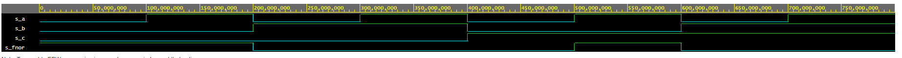
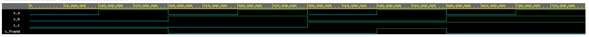
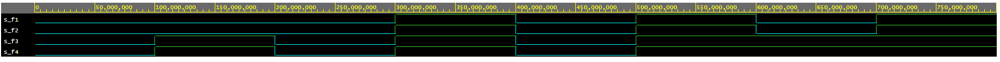

# cvičení 1. De Morganovy zákony.

## Odkaz na EDA playground:

[EDA palyground](https://www.edaplayground.com/x/8LrP)

## Funkce v základnímu úpravu

```vhdl
architecture dataflow of gates is
begin
    f_o  <= ((not b_i) and a_i) or ((not c_i) and (not b_i));
end architecture dataflow;
```

| **c** | **b** |**a** | **f(c,b,a)** |
| :-: | :-: | :-: | :-: |
| 0 | 0 | 0 | 1 |
| 0 | 0 | 1 | 1 |
| 0 | 1 | 0 | 0 |
| 0 | 1 | 1 | 0 |
| 1 | 0 | 0 | 0 |
| 1 | 0 | 1 | 1 |
| 1 | 1 | 0 | 0 |
| 1 | 1 | 1 | 0 |



## Funkce pomocí NOR

```vhdl
architecture dataflow of gates is
begin
   
    fnor_o <= not((b_i) or (not a_i)) or not((c_i) or (b_i));

end architecture dataflow;
```

| **c** | **b** |**a** | **f(c,b,a)** |
| :-: | :-: | :-: | :-: |
| 0 | 0 | 0 | 1 |
| 0 | 0 | 1 | 1 |
| 0 | 1 | 0 | 0 |
| 0 | 1 | 1 | 0 |
| 1 | 0 | 0 | 0 |
| 1 | 0 | 1 | 1 |
| 1 | 1 | 0 | 0 |
| 1 | 1 | 1 | 0 |



## Funkce pomocí NAND

```vhdl
architecture dataflow of gates is
begin
  
    fnand_o <= not(not((not b_i) and (a_i)) and not((not c_i) and (not b_i)));

end architecture dataflow;
```

| **c** | **b** |**a** | **f(c,b,a)** |
| :-: | :-: | :-: | :-: |
| 0 | 0 | 0 | 1 |
| 0 | 0 | 1 | 1 |
| 0 | 1 | 0 | 0 |
| 0 | 1 | 1 | 0 |
| 1 | 0 | 0 | 0 |
| 1 | 0 | 1 | 1 |
| 1 | 1 | 0 | 0 |
| 1 | 1 | 1 | 0 |



# Distributivní zákony

## Odkaz na EDA playground:

[EDA palyground](https://www.edaplayground.com/x/WSYj)

## VHDL kod:

```vhdl
architecture dataflow of gates is
begin
    	f1_o <= (x_i and y_i) or (x_i and z_i);
        f2_o <= x_i and (y_i or z_i);
        f3_o <= (x_i or y_i) and (x_i or z_i);
        f4_o <= x_i or (y_i and z_i);
    
end architecture dataflow;
```

Z obrázku vidíme, funkce f1 a F2 rovnají, taktéž funkce f3 a f4.




