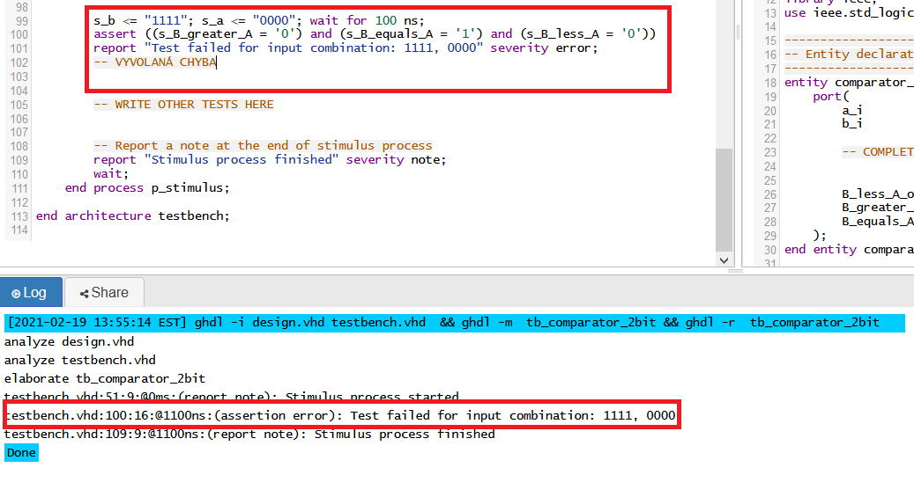
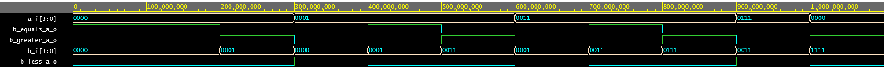

# Cvičení 2. Combinational logic.

## Odkaz na EDA playground:
[2-bit EDA playground](https://www.edaplayground.com/x/uCyF)</br>
[4-bit EDA playground](https://www.edaplayground.com/x/8SBm)</br>

## Pravdivostní tabulka:

| **Dec. equivalent** | **B[1:0]** | **A[1:0]** | **B is greater than A** | **B equals A** | **B is less than A** |
| :-: | :-: | :-: | :-: | :-: | :-: |
| 0 | 0 0 | 0 0 | 0 | 1 | 0 |
| 1 | 0 0 | 0 1 | 0 | 0 | 1 |
| 2 | 0 0 | 1 0 | 0 | 0 | 1 |
| 3 | 0 0 | 1 1 | 0 | 0 | 1 |
| 4 | 0 1 | 0 0 | 1 | 0 | 0 |
| 5 | 0 1 | 0 1 | 0 | 1 | 0 |
| 6 | 0 1 | 1 0 | 0 | 0 | 1 |
| 7 | 0 1 | 1 1 | 0 | 0 | 1 |
| 8 | 1 0 | 0 0 | 1 | 0 | 0 |
| 9 | 1 0 | 0 1 | 1 | 0 | 0 |
| 10 | 1 0 | 1 0 | 0 | 1 | 0 |
| 11 | 1 0 | 1 1 | 0 | 0 | 1 |
| 12 | 1 1 | 0 0 | 1 | 0 | 0 |
| 13 | 1 1 | 0 1 | 1 | 0 | 0 |
| 14 | 1 1 | 1 0 | 1 | 0 | 0 |
| 15 | 1 1 | 1 1 | 0 | 1 | 0 |

equals_SoP = m0 + m5 + m10 + m15 = (!b1.!b0.!a1.!a0) + (!b1.b0.!a1.a0) + (b1.!b0.a1.!a0) + (b1.b0.a1.a0)

less_PoS = M0 . M4 . M5 . M8 . M9 . M10 . M12 . M13 . M14 . M15 =</br>
(b1+b0+a1+a0).(b1+!b0+a1+a0).(b1+!b0+a1+!a0).(!b1+b0+a1+a0).(!b1+b0+a1+!a0).(!b1+b0+!a1+a0).(!b1+!b0+a1+a0).(!b1+!b0+a1+!a0).(!b1+!b0+!a1+a0).(!b1 +!b0+!a1+!a0)</br>

# Karnaughovy mapy

</br>

## Minimalizace K-map

</br>

# Realizace 4-bit. pomocí VHDL

## Chyba v EDU playground

Chyba byla vyvolána na posledním řádku realizace, vyýsledek je na obrázku níže.




## VHDL kód testbench:

```vhdl

     ------------------------------------------------------------------------
--
-- Testbench for 2-bit binary comparator.
-- EDA Playground
--
-- Copyright (c) 2020-2021 Tomas Fryza
-- Dept. of Radio Electronics, Brno University of Technology, Czechia
-- This work is licensed under the terms of the MIT license.
--
------------------------------------------------------------------------

library ieee;
use ieee.std_logic_1164.all;

------------------------------------------------------------------------
-- Entity declaration for testbench
------------------------------------------------------------------------
entity tb_comparator_2bit is
    -- Entity of testbench is always empty
end entity tb_comparator_2bit;

------------------------------------------------------------------------
-- Architecture body for testbench
------------------------------------------------------------------------
architecture testbench of tb_comparator_2bit is

    -- Local signals
    signal s_a           : std_logic_vector(4 - 1 downto 0);
    signal s_b           : std_logic_vector(4 - 1 downto 0);
    signal s_B_greater_A : std_logic;
    signal s_B_equals_A  : std_logic;
    signal s_B_less_A    : std_logic;

begin
    -- Connecting testbench signals with comparator_2bit entity (Unit Under Test)
    uut_comparator_2bit : entity work.comparator_2bit
        port map(
            a_i           => s_a,
            b_i           => s_b,
            B_greater_A_o => s_B_greater_A,
            B_equals_A_o  => s_B_equals_A,
            B_less_A_o    => s_B_less_A
        );

    --------------------------------------------------------------------
    -- Data generation process
    --------------------------------------------------------------------
    p_stimulus : process
    begin
        -- Report a note at the begining of stimulus process
        report "Stimulus process started" severity note;


        -- First test values
        s_b <= "0000"; s_a <= "0000"; wait for 100 ns;
       
            
        -- Expected output
        assert ((s_B_greater_A = '0') and (s_B_equals_A = '1') and (s_B_less_A = '0'))
        -- If false, then report an error
        report "Test failed for input combination: 0000, 0000" severity error;
        
            	s_b <= "0000"; s_a <= "0000"; wait for 100 ns;
		assert ((s_B_greater_A = '0') and (s_B_equals_A = '1') and (s_B_less_A = '0'))
		report "Test failed for input combination: 0000, 0000" severity error;
        
        s_b <= "0001"; s_a <= "0000"; wait for 100 ns;
		assert ((s_B_greater_A = '1') and (s_B_equals_A = '0') and (s_B_less_A = '0'))
		report "Test failed for input combination: 0001, 0000" severity error;
        
        s_b <= "0000"; s_a <= "0001"; wait for 100 ns;
		assert ((s_B_greater_A = '0') and (s_B_equals_A = '0') and (s_B_less_A = '1'))
		report "Test failed for input combination: 0000, 0001" severity error;
        
               	s_b <= "0001"; s_a <= "0001"; wait for 100 ns;
		assert ((s_B_greater_A = '0') and (s_B_equals_A = '1') and (s_B_less_A = '0'))
		report "Test failed for input combination: 0001, 000+" severity error;
        
        s_b <= "0011"; s_a <= "0001"; wait for 100 ns;
		assert ((s_B_greater_A = '1') and (s_B_equals_A = '0') and (s_B_less_A = '0'))
		report "Test failed for input combination: 0011, 0001" severity error;
        
        s_b <= "0001"; s_a <= "0011"; wait for 100 ns;
		assert ((s_B_greater_A = '0') and (s_B_equals_A = '0') and (s_B_less_A = '1'))
		report "Test failed for input combination: 0001, 0011" severity error;
        
               	s_b <= "0011"; s_a <= "0011"; wait for 100 ns;
		assert ((s_B_greater_A = '0') and (s_B_equals_A = '1') and (s_B_less_A = '0'))
		report "Test failed for input combination: 0011, 0011" severity error;
        
        s_b <= "0111"; s_a <= "0011"; wait for 100 ns;
		assert ((s_B_greater_A = '1') and (s_B_equals_A = '0') and (s_B_less_A = '0'))
		report "Test failed for input combination: 0111, 0011" severity error;
        
        s_b <= "0011"; s_a <= "0111"; wait for 100 ns;
		assert ((s_B_greater_A = '0') and (s_B_equals_A = '0') and (s_B_less_A = '1'))
		report "Test failed for input combination: 0011, 0111" severity error;
        
        s_b <= "1111"; s_a <= "0000"; wait for 100 ns;
		assert ((s_B_greater_A = '0') and (s_B_equals_A = '1') and (s_B_less_A = '0'))
		report "Test failed for input combination: 1111, 0000" severity error;
		
        
        
        -- WRITE OTHER TESTS HERE


        -- Report a note at the end of stimulus process
        report "Stimulus process finished" severity note;
        wait;
    end process p_stimulus;

end architecture testbench;

```
## VHDL kód design
```vhdl
------------------------------------------------------------------------
--
-- Example of 2-bit binary comparator using the when/else assignment.
-- EDA Playground
--
-- Copyright (c) 2020-2021 Tomas Fryza
-- Dept. of Radio Electronics, Brno University of Technology, Czechia
-- This work is licensed under the terms of the MIT license.
--
------------------------------------------------------------------------

library ieee;
use ieee.std_logic_1164.all;

------------------------------------------------------------------------
-- Entity declaration for 2-bit binary comparator
------------------------------------------------------------------------
entity comparator_2bit is
    port(
        a_i           : in  std_logic_vector(4 - 1 downto 0);
		b_i           : in  std_logic_vector(4 - 1 downto 0);

        -- COMPLETE ENTITY DECLARATION


        B_less_A_o    : out std_logic;       -- B is less than A
    	B_greater_A_o : out std_logic;
        B_equals_A_o  : out std_logic
    );
end entity comparator_2bit;

------------------------------------------------------------------------
-- Architecture body for 2-bit binary comparator
------------------------------------------------------------------------
architecture Behavioral of comparator_2bit is
begin
    B_less_A_o    <= '1' when (b_i < a_i) else '0';
    B_greater_A_o <= '1' when (b_i > a_i) else '0';
    B_equals_A_o  <= '1' when (b_i = a_i) else '0';


    -- WRITE "GREATER" AND "EQUALS" ASSIGNMENTS HERE


end architecture Behavioral;
```
