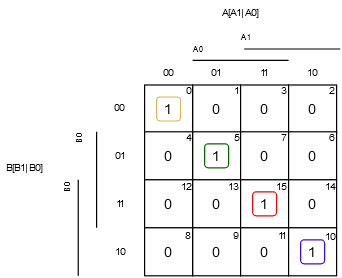
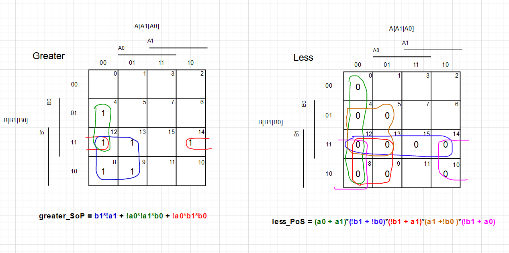

# Cvičení 2. Combinational logic.

## Odkaz na EDA playground:

## Pravdivostní tabulka:

| **Dec. equivalent** | **B[1:0]** | **A[1:0]** | **B is greater than A** | **B equals A** | **B is less than A** |
| :-: | :-: | :-: | :-: | :-: | :-: |
| 0 | 0 0 | 0 0 | 0 | 1 | 0 |
| 1 | 0 0 | 0 1 | 0 | 0 | 1 |
| 2 | 0 0 | 1 0 | 0 | 0 | 1 |
| 3 | 0 0 | 1 1 | 0 | 0 | 1 |
| 4 | 0 1 | 0 0 | 1 | 0 | 0 |
| 5 | 0 1 | 0 1 | 0 | 1 | 0 |
| 6 | 0 1 | 1 0 | 0 | 0 | 1 |
| 7 | 0 1 | 1 1 | 0 | 0 | 1 |
| 8 | 1 0 | 0 0 | 1 | 0 | 0 |
| 9 | 1 0 | 0 1 | 1 | 0 | 0 |
| 10 | 1 0 | 1 0 | 0 | 1 | 0 |
| 11 | 1 0 | 1 1 | 0 | 0 | 1 |
| 12 | 1 1 | 0 0 | 1 | 0 | 0 |
| 13 | 1 1 | 0 1 | 1 | 0 | 0 |
| 14 | 1 1 | 1 0 | 1 | 0 | 0 |
| 15 | 1 1 | 1 1 | 0 | 1 | 0 |

equals_SoP = m0 + m5 + m10 + m15 = (!b1.!b0.!a1.!a0) + (!b1.b0.!a1.a0) + (b1.!b0.a1.!a0) + (b1.b0.a1.a0)

less_PoS = M0 . M4 . M5 . M8 . M9 . M10 . M12 . M13 . M14 . M15 =</br>
(b1+b0+a1+a0).(b1+!b0+a1+a0).(b1+!b0+a1+!a0).(!b1+b0+a1+a0).(!b1+b0+a1+!a0).(!b1+b0+!a1+a0).(!b1+!b0+a1+a0).(!b1+!b0+a1+!a0).(!b1+!b0+!a1+a0).(!b1 +!b0+!a1+!a0)</br>

# Karnaughovy mapy

</br>

## Minimalizace K-map

</br>

## Realizace 4-bit. pomocí VHDL

## VHDL kód testbench:

```vhdl

       p_stimulus : process
    begin
       
        report "Stimulus process started" severity note;
       
        s_b <= "0000"; s_a <= "0000"; wait for 100 ns;
            
        assert ((s_B_greater_A = '0') and (s_B_equals_A = '1') and (s_B_less_A = '0'))
        -- If false, then report an error
        report "Test failed for input combination: 0000, 0000" severity error;
        
            	s_b <= "0000"; s_a <= "0000"; wait for 100 ns;
		assert ((s_B_greater_A = '0') and (s_B_equals_A = '1') and (s_B_less_A = '0'))
		report "Test failed for input combination: 0000, 0000" severity error;
        
        s_b <= "0001"; s_a <= "0000"; wait for 100 ns;
		assert ((s_B_greater_A = '1') and (s_B_equals_A = '0') and (s_B_less_A = '0'))
		report "Test failed for input combination: 0001, 0000" severity error;
        
        s_b <= "0000"; s_a <= "0001"; wait for 100 ns;
		assert ((s_B_greater_A = '0') and (s_B_equals_A = '0') and (s_B_less_A = '1'))
		report "Test failed for input combination: 0000, 0001" severity error;
        
               	s_b <= "0001"; s_a <= "0001"; wait for 100 ns;
		assert ((s_B_greater_A = '0') and (s_B_equals_A = '1') and (s_B_less_A = '0'))
		report "Test failed for input combination: 0001, 000+" severity error;
        
        s_b <= "0011"; s_a <= "0001"; wait for 100 ns;
		assert ((s_B_greater_A = '1') and (s_B_equals_A = '0') and (s_B_less_A = '0'))
		report "Test failed for input combination: 0011, 0001" severity error;
        
        s_b <= "0001"; s_a <= "0011"; wait for 100 ns;
		assert ((s_B_greater_A = '0') and (s_B_equals_A = '0') and (s_B_less_A = '1'))
		report "Test failed for input combination: 0001, 0011" severity error;
        
               	s_b <= "0011"; s_a <= "0011"; wait for 100 ns;
		assert ((s_B_greater_A = '0') and (s_B_equals_A = '1') and (s_B_less_A = '0'))
		report "Test failed for input combination: 0011, 0011" severity error;
        
        s_b <= "0111"; s_a <= "0011"; wait for 100 ns;
		assert ((s_B_greater_A = '1') and (s_B_equals_A = '0') and (s_B_less_A = '0'))
		report "Test failed for input combination: 0111, 0011" severity error;
        
        s_b <= "0011"; s_a <= "0111"; wait for 100 ns;
		assert ((s_B_greater_A = '0') and (s_B_equals_A = '0') and (s_B_less_A = '1'))
		report "Test failed for input combination: 0011, 0111" severity error;
        
        s_b <= "1111"; s_a <= "0000"; wait for 100 ns;
		assert ((s_B_greater_A = '0') and (s_B_equals_A = '1') and (s_B_less_A = '0'))
		report "Test failed for input combination: 1111, 0000" severity error;

        report "Stimulus process finished" severity note;
        wait;
    end process p_stimulus;
```
## VHDL kód design
```vhdl
architecture Behavioral of comparator_2bit is
begin
    B_less_A_o    <= '1' when (b_i < a_i) else '0';
    B_greater_A_o <= '1' when (b_i > a_i) else '0';
    B_equals_A_o  <= '1' when (b_i = a_i) else '0';


    -- WRITE "GREATER" AND "EQUALS" ASSIGNMENTS HERE


end architecture Behavioral;
```