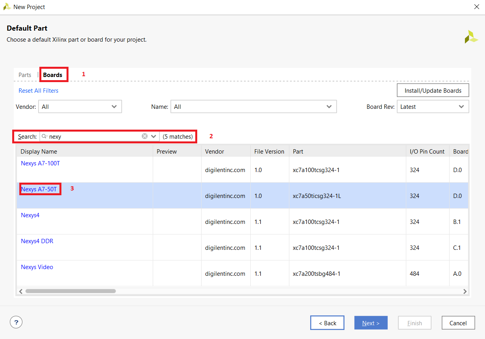

# Cvičení 3. Vivado

## První část cvičení - implementace 2-bit_mux_4to1

Porty pro připojení switchů a ledek byly nalezeny v manuálu na webové stránce:

[Nexys A7 manual](https://reference.digilentinc.com/reference/programmable-logic/nexys-a7/reference-manual) 

### Tabulka switche a ledky

| **SWITCH** | **PORT** | **LED** | **PORT** |
| :-: | :-: | :-: | :-: |		     
| SW0 | J15 | LED0 | H17 |		     
| SW1 | L16 | LED1 | K15 |		     
| SW2 | M13 | LED2 | J13 |	            			
| SW3 | R15 | LED3 | N14 |		 
| SW4 | R17 | LED4 | R18 |		     
| SW5 | T18 | LED5 | V17 |	             
| SW6 | U18 | LED6 | U17 |	             
| SW7 | R13 | LED7 | U16 |
| SW8 | T8 | LED8 | V16 |
| SW9 | U8 | LED9 | T15 |
| SW10 | R16 | LED10 | U14 |
| SW11 | T13 | LED11 | T16 |
| SW12 | H6 | LED12 | V15 |
| SW13 | U12 | LED13 | V14 |
| SW14 | U11 | LED14 | V12 |
| Sw15 | V10 | LED15 | V11 |

### VHDL kód Architecture
```vhdl
architecture Behavioral of comparator_2bit is
begin

f_o <= a_i when (sel_i ="00") else
          b_i when (sel_i ="01") else
          c_i when (sel_i ="10") else
          d_i when (sel_i ="11");

end architecture Behavioral;
```
### VHDL kód Stimulus process
```vhdl
 p_stimulus : process
    begin

        report "Stimulus process started" severity note;

        s_d <= "00"; s_c <= "00";s_b <= "00"; s_a <= "00";
        s_sel <= "00";wait for 100ns;
        
        s_d <= "01"; s_c <= "01";s_b <= "00"; s_a <= "00";
        s_sel <= "01";wait for 100ns;
        
        s_d <= "00"; s_c <= "00";s_b <= "01"; s_a <= "01";
        s_sel <= "00";wait for 100ns;
        
        s_d <= "01"; s_c <= "01";s_b <= "01"; s_a <= "01";
        s_sel <= "01";wait for 100ns;
        
        s_d <= "11"; s_c <= "11";s_b <= "01"; s_a <= "01";
        s_sel <= "11";wait for 100ns;
        
        s_d <= "01"; s_c <= "01";s_b <= "11"; s_a <= "11";
        s_sel <= "11";wait for 100ns;
        
        s_d <= "11"; s_c <= "11";s_b <= "11"; s_a <= "11";
        s_sel <= "11";wait for 100ns;
        
        s_d <= "11"; s_c <= "01";s_b <= "11"; s_a <= "01";
        s_sel <= "01";wait for 100ns;
        
        s_d <= "11"; s_c <= "11";s_b <= "11"; s_a <= "11";
        s_sel <= "00";wait for 100ns;
        
        s_d <= "01"; s_c <= "01";s_b <= "11"; s_a <= "10";
        s_sel <= "10";wait for 100ns;
        
        
        report "Stimulus process finished" severity note;
        wait;
    end process p_stimulus;
```
### Simulace


## Druhá část cvičení - návod na Vivado
### Založení projektu
Po otevření programu Vivado zadáme *Create new project*. Vyskočí nám nové okno, kde klikneme na tlačítko *next*. Okno nám poskočí na další stránku, kde vyplníme název projektu, popřípadě změníme místo uložení. Dále budeme klikat na *next*, dokud se nám nezobrazí okno s výběrem desky. Viz. obrázek níže.
Postupujeme přesně jako na obrázku. Nejříve si vybereme záložku *boards* a v pole pro vyhledávání napíšešme *Nexys* vě výběru potom volíme *Nexys A7-50T* a dáme next. Na další straně už klikneme na tlačítko *finish*, pro vytvoření projektu.
</br>
Předchozími kroky jsme vytvořili prázdný projekt. Nyní si do projektu přidáme nějaké soubory. Nejdříve si přídáme soubor pro *design* z [EDA playground](https://www.edaplayground.com/x/uCyF) zkopírujeme kód z *design*. V programu Vivado v navigační liště klikneme na *add sources* dále vybereme *add or create design sources*, klikneme na *next*.
</br>
</br>
Na další straně vybereme *Create file*. Po vyskočení okénka vybereme jazyk VHDL a zadáme název.
</br>
 Klikneme na *finish*, pak už jen vše potvrdíme.


