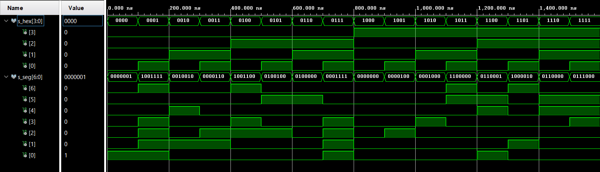

# Cvičení 4. Segment
## Pravdivostní tabulka
| **Hex** | **Inputs** | **A** | **B** | **C** | **D** | **E** | **F** | **G** |
| :-: | :-: | :-: | :-: | :-: | :-: | :-: | :-: | :-: |
| 0 | 0000 | 0 | 0 | 0 | 0 | 0 | 0 | 1 |
| 1 | 0001 | 1 | 0 | 0 | 1 | 1 | 1 | 1 |
| 2 | 0010 | 1 | 0 | 0 | 1 | 1 | 1 | 1 |
| 3 | 0011 | 0 | 0 | 0 | 0 | 1 | 1 | 0 |
| 4 | 0100 | 1 | 0 | 0 | 1 | 1 | 0 | 0 |
| 5 | 0101 | 0 | 1 | 0 | 0 | 1 | 0 | 0 |
| 6 | 0110 | 0 | 1 | 0 | 0 | 0 | 0 | 0 |
| 7 | 0111 | 0 | 0 | 0 | 1 | 1 | 1 | 1 |
| 8 | 1000 | 0 | 0 | 0 | 0 | 0 | 0 | 0 |
| 9 | 1001 | 0 | 0 | 0 | 1 | 1 | 0 | 0 |
| A | 1010 | 0 | 0 | 0 | 1 | 0 | 0 | 0 |
| B | 1011 | 1 | 1 | 0 | 0 | 0 | 0 | 0 |
| C | 1100 | 1 | 1 | 1 | 0 | 0 | 1 | 0 |
| D | 1101 | 1 | 0 | 0 | 0 | 0 | 1 | 0 |
| E | 1110 | 0 | 1 | 1 | 0 | 0 | 0 | 0 |
| F | 1111 | 0 | 1 | 1 | 1 | 0 | 0 | 0 |
## VHDL Design kód ze souboru `hex_7seg.vhd`
```vhdl
architecture behavioral of hex_7seg is

begin

 p_7seg_decoder : process(hex_i)
    begin
        case hex_i is
            when "0000" =>
                seg_o <= "0000001";     -- 0
            when "0001" =>
                seg_o <= "1001111";     -- 1
            when "0010" =>
                seg_o <= "0010010";     -- 2    
            when "0011" =>
                seg_o <= "0000110";     -- 3
            when "0100" =>
                seg_o <= "1001100";     -- 4
            when "0101" =>
                seg_o <= "0100100";     -- 5
            when "0110" =>
                seg_o <= "0100000";     -- 6
            when "0111" =>
                seg_o <= "0001111";     -- 7
            when "1000" =>
                seg_o <= "0000000";     -- 8
            when "1001" =>
                seg_o <= "0000100";     -- 9
            when "1010" =>
                seg_o <= "0001000";     -- A
            when "1011" =>
                seg_o <= "1100000";     -- b
            when "1100" =>
                seg_o <= "0110001";     -- C
            when "1101" =>
                seg_o <= "1000010";     -- d
            when "1110" =>
                seg_o <= "0110000";     -- E
            when others =>
                seg_o <= "0111000";     -- F
        end case;
    end process p_7seg_decoder;

end architecture behavioral;
```
## VHDL kod se souboru `tb_hex_7seg.vhd`
```vhdl
p_7seg_decoder : process
    begin
    
    s_hex <= "0000";
    wait for 100ns;
    assert (s_seg = "0000001")
    report "Number: 0 failed" severity error;
    
    s_hex <= "0001";
    wait for 100ns;
    assert (s_seg = "1001111")
    report "Number: 1 failed" severity error;
   
    s_hex <= "0010";
    wait for 100ns;
    assert (s_seg = "0010010")
    report "Number: 2 failed" severity error;
    
    s_hex <= "0011";
    wait for 100ns;
    assert (s_seg = "0000110")
    report "Number: 3 failed" severity error;
    
    s_hex <= "0100";
    wait for 100ns;
    assert (s_seg = "1001100")
    report "Number: 4 failed" severity error;
    
    s_hex <= "0101";
    wait for 100ns;
    assert (s_seg = "0100100")
    report "Number: 5 failed" severity error;
    
    s_hex <= "0110";
    wait for 100ns;
    assert (s_seg = "0100000")
    report "Number: 6 failed" severity error;
    
    s_hex <= "0111";
    wait for 100ns;
    assert (s_seg = "0001111")
    report "Number: 7 failed" severity error;
    
    s_hex <= "1000";
    wait for 100ns;
    assert (s_seg = "0000000")
    report "Number: 8 failed" severity error;
    
    s_hex <= "1001";
    wait for 100ns;
    assert (s_seg = "0000100")
    report "Value: 9 failed" severity error;
    
    s_hex <= "1010";
    wait for 100ns;
    assert (s_seg = "0001000")
    report "Value: A failed" severity error;
    
    s_hex <= "1011";
    wait for 100ns;
    assert (s_seg = "1100000")
    report "Value: b failed" severity error;
    
    s_hex <= "1100";
    wait for 100ns;
    assert (s_seg = "0110011")
    report "Value: C failed" severity error;
    
    s_hex <= "1101";
    wait for 100ns;
    assert (s_seg = "1000010")
    report "Value: d failed" severity error;
    
    s_hex <= "1110";
    wait for 100ns;
    assert (s_seg = "0110000")
    report "Value: E failed" severity error;
    
    s_hex <= "1111";
    wait for 100ns;
    assert (s_seg = "0111000")
    report "Value: E failed" severity error;
    
    
    end process p_7seg_decoder;
```
## Simulace
 
