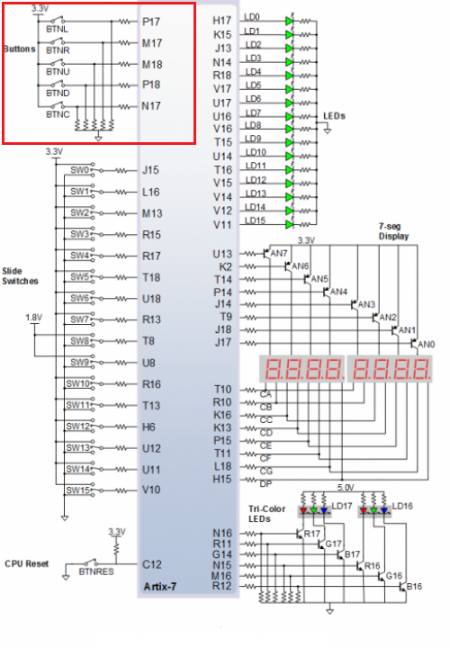

# Cvičení 5. Counter

## Tabulka a zapojení pinů pro LED z přípravy

| **Time interval** | **Number of clk periods** | **Number of clk periods in hex** | **Number of clk periods in binary** |
| :-: | :-: | :-: | :-: |
| 2&nbsp;ms | 200 000 | `x"3_0d40"` | `b"0011_0000_1101_0100_0000"` |
| 4&nbsp;ms | 400 000 | `x"6_1a80"` | `b"0110_0001_1010_1000_0000"` |
| 10&nbsp;ms|1 000 000 | `x"f_4240"` | `b"1111_0100_0010_0100_0000"` |
| 250&nbsp;ms |25 000 000 | `x"17d_7840"` | `b"0001_0111_1101_0111_1000_0100_0000"` |
| 500&nbsp;ms |50 000 000 | `x"2fa_f080"` | `b"0010_1111_1010_1111_0000_1000_0000"` |
| 1&nbsp;sec | 100 000 000 | `x"5F5_E100"` | `b"0101_1111_0101_1110_0001_0000_0000"` |



## Obousměrný číatač design kód procesu ze souboru`p_cnt_up_down`
```vhdl
 p_cnt_up_down : process(clk)
    begin
        if rising_edge(clk) then
        
            if (reset = '1') then               -- Synchronous reset
                s_cnt_local <= (others => '0'); -- Clear all bits
                    elsif (en_i = '1') then       -- Test if counter is enabled
                    if(cnt_up_i = '1')then
                        s_cnt_local <= s_cnt_local + 1;
                        else 
                        s_cnt_local <= s_cnt_local - 1;
                    end if;
            end if;
        end if;
    end process p_cnt_up_down;
```
## Obousměrný číatač testbench kód procesu ze souboru`tb_cnt_up_down.vhd`
### Pro reset
```vhdl 
p_reset_gen : process
    begin
        s_reset <= '0';
        wait for 12 ns;
        s_reset <= '1';                 -- Reset activated
        wait for 73 ns;
        s_reset <= '0';
        wait;
    end process p_reset_gen;
```
### Pro process
```vhdl
p_stimulus : process
    begin
        report "Stimulus process started" severity note;

        s_en     <= '1';                -- Enable counting
        s_cnt_up <= '1';
        wait for 380 ns;                -- Change counter direction
        s_cnt_up <= '0';
        wait for 220 ns;
        s_en     <= '0';                -- Disable counting

        report "Stimulus process finished" severity note;
        wait;
    end process p_stimulus;
```


