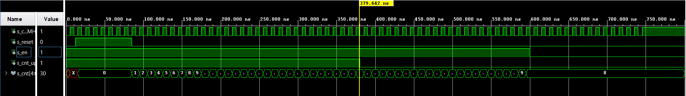

# Cvičení 5. Counter

## Tabulka a zapojení pinů pro LED z přípravy

| **Time interval** | **Number of clk periods** | **Number of clk periods in hex** | **Number of clk periods in binary** |
| :-: | :-: | :-: | :-: |
| 2&nbsp;ms | 200 000 | `x"3_0d40"` | `b"0011_0000_1101_0100_0000"` |
| 4&nbsp;ms | 400 000 | `x"6_1a80"` | `b"0110_0001_1010_1000_0000"` |
| 10&nbsp;ms|1 000 000 | `x"f_4240"` | `b"1111_0100_0010_0100_0000"` |
| 250&nbsp;ms |25 000 000 | `x"17d_7840"` | `b"0001_0111_1101_0111_1000_0100_0000"` |
| 500&nbsp;ms |50 000 000 | `x"2fa_f080"` | `b"0010_1111_1010_1111_0000_1000_0000"` |
| 1&nbsp;sec | 100 000 000 | `x"5F5_E100"` | `b"0101_1111_0101_1110_0001_0000_0000"` |


## Obousměrný čítač design kód procesu ze souboru`p_cnt_up_down`
```vhdl
 p_cnt_up_down : process(clk)
    begin
        if rising_edge(clk) then
        
            if (reset = '1') then               -- Synchronous reset
                s_cnt_local <= (others => '0'); -- Clear all bits
                    elsif (en_i = '1') then       -- Test if counter is enabled
                    if(cnt_up_i = '1')then
                        s_cnt_local <= s_cnt_local + 1;
                        else 
                        s_cnt_local <= s_cnt_local - 1;
                    end if;
            end if;
        end if;
    end process p_cnt_up_down;
```
## Obousměrný čítač testbench kód procesu ze souboru`tb_cnt_up_down.vhd`
### Pro reset
```vhdl 
p_reset_gen : process
    begin
        s_reset <= '0';
        wait for 12 ns;
        s_reset <= '1';                 -- Reset activated
        wait for 73 ns;
        s_reset <= '0';
        wait;
    end process p_reset_gen;
```
### Pro process
```vhdl
p_stimulus : process
    begin
        report "Stimulus process started" severity note;

        s_en     <= '1';                -- Enable counting
        s_cnt_up <= '1';
        wait for 380 ns;                -- Change counter direction
        s_cnt_up <= '0';
        wait for 220 ns;
        s_en     <= '0';                -- Disable counting

        report "Stimulus process finished" severity note;
        wait;
    end process p_stimulus;
```
## Simulace
### Celková simulace

### Změna směru čítání


## Kód ze souboru `top.vhd`
```vhdl

library IEEE;
use IEEE.STD_LOGIC_1164.ALL;

-- Uncomment the following library declaration if using
-- arithmetic functions with Signed or Unsigned values
--use IEEE.NUMERIC_STD.ALL;

-- Uncomment the following library declaration if instantiating
-- any Xilinx leaf cells in this code.
--library UNISIM;
--use UNISIM.VComponents.all;

entity top is
    Port ( CLK100MHZ : in STD_LOGIC;
           BTNC : in STD_LOGIC;
           SW : in STD_LOGIC_VECTOR (1 - 1 downto 0);
           CA : out STD_LOGIC;
           CB : out STD_LOGIC;
           CC : out STD_LOGIC;
           CD : out STD_LOGIC;
           CE : out STD_LOGIC;
           CF : out STD_LOGIC;
           CG : out STD_LOGIC;
           AN : out STD_LOGIC_VECTOR (8 - 1 downto 0));
end top;

architecture Behavioral of top is

    -- Internal clock enable
    signal s_en  : std_logic;
    -- Internal counter
    signal s_cnt : std_logic_vector(4 - 1 downto 0);

begin

    --------------------------------------------------------------------
    -- Instance (copy) of clock_enable entity
    clk_en0 : entity work.clock_enable
        generic map(
                g_MAX => 2500000
            )
            port map (
            clk => CLK100MHZ,
            reset => BTNC,
            ce_o => s_en
            );

    --------------------------------------------------------------------
    -- Instance (copy) of cnt_up_down entity
    bin_cnt0 : entity work.cnt_up_down
        generic map (
            g_CNT_WIDTH => 4
            )
            port map (
            clk => CLK100MHZ,
            reset => BTNC,
            en_i => s_en,
            cnt_up_i => SW(0),
            cnt_o => s_cnt
            );

    -- Display input value on LEDs
    LED(3 downto 0) <= s_cnt;
    --------------------------------------------------------------------
    -- Instance (copy) of hex_7seg entity
    hex2seg : entity work.hex_7seg
        port map(
            hex_i    => s_cnt,
            seg_o(6) => CA,
            seg_o(5) => CB,
            seg_o(4) => CC,
            seg_o(3) => CD,
            seg_o(2) => CE,
            seg_o(1) => CF,
            seg_o(0) => CG
        );

    -- Connect one common anode to 3.3V
    AN <= b"1111_1110";
    
end Behavioral;
```
## Obrázek 4 a 16 bitového čítače


