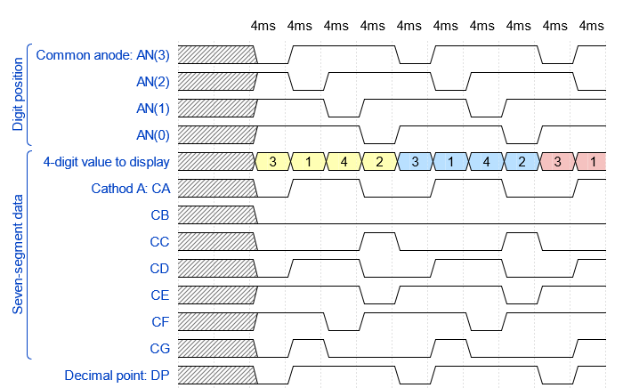
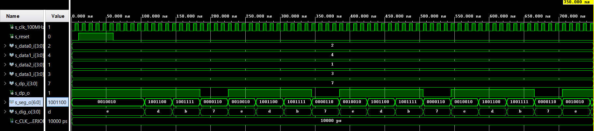

# Cvičení 6 Display driver
## Příprava na cvičení
```js
{
  signal:
  [
    ['Digit position',
      {name: 'Common anode: AN(3)', wave: 'xx01..01..01'},
      {name: 'AN(2)', wave: 'xx101..01..0'},
      {name: 'AN(1)', wave: 'xx1.01..01..'},
      {name: 'AN(0)', wave: 'xx1..01..01.'},
    ],
    ['Seven-segment data',
      {name: '4-digit value to display', wave: 'xx3333555599', data: ['3','1','4','2','3','1','4','2','3','1']},
      {name: 'Cathod A: CA', wave: 'xx01.0.1.0.1'},
      {name: 'CB', wave: 'xx0.........'},
      {name: 'CC', wave: 'xx0..10..10.'},
      {name: 'CD', wave: 'xx01.0.1.0.1'},
      {name: 'CE', wave: 'xx1..01..01.'},
      {name: 'CF', wave: 'xx1.01..01..'},
      {name: 'CG', wave: 'xx010..10..1'},
    ],
    {name: 'Decimal point: DP', wave: 'xx01..01..01'},
  ],
  head:
  {
    text: '                    4ms   4ms   4ms   4ms   4ms   4ms   4ms   4ms   4ms   4ms',
  },
}
```


## VHDL kód `p_mux`
```vhdl
p_mux : process(s_cnt, data0_i, data1_i, data2_i, data3_i, dp_i)
    begin
        case s_cnt is
            when "11" =>
                s_hex <= data3_i;
                dp_o  <= dp_i(3);
                dig_o <= "0111";

            when "10" =>
                s_hex <= data2_i;
                dp_o  <= dp_i(2);
                dig_o <= "1011";

            when "01" =>
                 s_hex <= data1_i;
                dp_o  <= dp_i(1);
                dig_o <= "1101";

            when others =>
                s_hex <= data0_i;
                dp_o  <= dp_i(0);
                dig_o <= "1110";
            
        end case;
    end process p_mux;
```
## VHDL kód testbench

library ieee;
use ieee.std_logic_1164.all;

------------------------------------------------------------------------
-- Entity declaration for testbench
------------------------------------------------------------------------
entity tb_driver_7seg_4digits is
    -- Entity of testbench is always empty
end entity tb_driver_7seg_4digits;

------------------------------------------------------------------------
-- Architecture body for testbench
------------------------------------------------------------------------
architecture testbench of tb_driver_7seg_4digits is

    -- Local constants
    constant c_CLK_100MHZ_PERIOD : time    := 10 ns;

    --Local signals
      signal s_clk_100MHz : std_logic;
      signal s_reset      : std_logic;
      
      signal s_data0_i : std_logic_vector(4 - 1 downto 0);
      signal s_data1_i : std_logic_vector(4 - 1 downto 0);
      signal s_data2_i : std_logic_vector(4 - 1 downto 0);
      signal s_data3_i : std_logic_vector(4 - 1 downto 0);
      
      signal s_dp_i    : std_logic_vector(4 - 1 downto 0);
      signal s_dp_o    : std_logic; 
      signal s_seg_o   : std_logic_vector(7 - 1 downto 0);  
      signal s_dig_o   : std_logic_vector(4 - 1 downto 0);
          
   

begin
    -- Connecting testbench signals with driver_7seg_4digits entity
    -- (Unit Under Test)
  uut_driver_7seg : entity work.driver_7seg_4digits
 port map(          
       clk      => s_clk_100MHZ,    
       reset    => s_reset,  
          
       data0_i  => s_data0_i,
       data1_i  => s_data1_i,
       data2_i  => s_data2_i,
       data3_i  => s_data3_i,
                 
       dp_i     => s_dp_i,      
       dp_o     => s_dp_o, 
       seg_o    => s_seg_o,       
       dig_o    => s_dig_o  
 );                   
    -------------         -------------------------------------------------------
    -- Clock generation process
    --------------------------------------------------------------------
    p_clk_gen : process
    begin
        while now < 750 ns loop         
            s_clk_100MHz <= '0';
            wait for c_CLK_100MHZ_PERIOD / 2;
            s_clk_100MHz <= '1';
            wait for c_CLK_100MHZ_PERIOD / 2;
        end loop;
        wait;
    end process p_clk_gen;

    --------------------------------------------------------------------
    -- Reset generation process
    --------------------------------------------------------------------
   p_reset_gen : process
    begin
        s_reset <= '0';
        wait for 10 ns;
        s_reset <= '1';         -- Reset activated
        wait for 50 ns;

        s_reset <= '0';
        wait;
    end process p_reset_gen;
    
p_stimulus : process
    begin
        report "Stimulus process started" severity note;
        s_data3_i <= "0011"; --  3 -- last segment
        s_data2_i <= "0001"; --  1 
        s_data1_i <= "0100"; --  4 
        s_data0_i <= "0010"; --  2 -- first segment
        
        s_dp_i    <= "0111"; --  . --  for decimal
       
        -- 3.142
        wait for 385 ns;
        assert(s_seg_o = "0010010") -- 2
        report "First segment error" severity error;
        
        assert(s_seg_o = "1001100") -- 4
        report "Second segment error" severity error;
        
        assert(s_seg_o = "1001111") -- 1
        report "Third segment error" severity error;
        
        assert(s_dp_o = '0') -- decimal point
        report "Decimal point error" severity error;
        
        assert(s_seg_o = "0000110") -- 3
        report "Fourth segment error" severity error;
  
      report "Stimulus process finished" severity note;
        wait;
    end process p_stimulus;
 
end architecture testbench;
##Simulace

## VHDL kód `top`
```vhdl
library IEEE;
use IEEE.STD_LOGIC_1164.ALL;

-- Uncomment the following library declaration if using
-- arithmetic functions with Signed or Unsigned values
--use IEEE.NUMERIC_STD.ALL;

-- Uncomment the following library declaration if instantiating
-- any Xilinx leaf cells in this code.
--library UNISIM;
--use UNISIM.VComponents.all;

entity top is
    Port ( CLK100MHZ : in STD_LOGIC;
           BTNC : in STD_LOGIC;
           SW : in STD_LOGIC_VECTOR (16 - 1 downto 0);
           CA : out STD_LOGIC;
           CB : out STD_LOGIC;
           CC : out STD_LOGIC;
           CD : out STD_LOGIC;
           CE : out STD_LOGIC;
           CF : out STD_LOGIC;
           CG : out STD_LOGIC;
           DP : out STD_LOGIC;
           AN : out STD_LOGIC_VECTOR (8 - 1 downto 0));
end top;

architecture Behavioral of top is
    -- No internal signals
begin
    --------------------------------------------------------------------
    -- Instance (copy) of driver_7seg_4digits entity
    driver_seg_4 : entity work.driver_7seg_4digits
        port map(
            clk        => CLK100MHZ,
            reset      => BTNC,
            data0_i(3) => SW(3),
            data0_i(2) => SW(2),
            data0_i(1) => SW(1),
            data0_i(0) => SW(0),
            
            data1_i(3) => SW(7),
            data1_i(2) => SW(6),
            data1_i(1) => SW(5),
            data1_i(0) => SW(4),
            
            data2_i(3) => SW(11),
            data2_i(2) => SW(10),
            data2_i(1) => SW(9),
            data2_i(0) => SW(8),
            
            data3_i(3) => SW(15),
            data3_i(2) => SW(14),
            data3_i(1) => SW(13),
            data3_i(0) => SW(12),
            
            seg_o(6)    => CA,
            seg_o(5)    => CB,
            seg_o(4)    => CC,
            seg_o(3)    => CD,
            seg_o(2)    => CE,
            seg_o(1)    => CF,
            seg_o(0)    => CG,
            
            dig_o(0)    => AN(0),
            dig_o(1)    => AN(1),
            dig_o(2)    => AN(2),
            dig_o(3)    => AN(3),
            
            dp_i       => "0111",
            dp_o       => DP
        );

    -- Disconnect the top four digits of the 7-segment display
    AN(7 downto 4) <= b"1111";

end architecture Behavioral;
```


