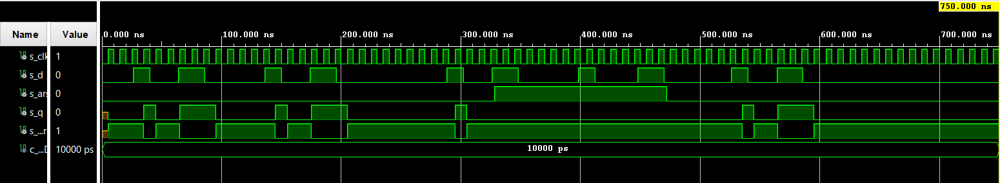

# 7. Cvičení - ffs

## Domácí příprava
Pravdivostní tabulky

   | **D** | **Qn** | **Q(n+1)** | **Comments** |
   | :-: | :-: | :-: | :-- |
   | 0 | 0 | 0 | No change |
   | 0 | 1 | 1 | Change |
   | 1 | 0 | 0 | Change |
   | 1 | 1 | 1 | No change |

   | **J** | **K** | **Qn** | **Q(n+1)** | **Comments** |
   | :-: | :-: | :-: | :-: | :-- |
   | 0 | 0 | 0 | 0 | No change |
   | 0 | 0 | 1 | 1 | No change |
   | 0 | 1 | 0 | 0 | Reset |
   | 0 | 1 | 1 | 0 | Reset |
   | 1 | 0 | 1 | 1 | Set |
   | 1 | 1 | 1 | 1 | Set |
   | 1 | 1 | 0 | 1 | Toggle |
   | 1 | 1 | 1 | 0 | Toggle |

   | **T** | **Qn** | **Q(n+1)** | **Comments** |
   | :-: | :-: | :-: | :-- |
   | 0 | 0 | 0 | No change |
   | 0 | 1 | 1 | No change |
   | 1 | 0 | 1 | Invert (toggle) |
   | 1 | 1 | 0 | Invert (toggle) |

## D-latch vhdl kód z `p_d_latch`, process
```vhdl
p_d_latch : process(en, d, arst)
    begin
        if (arst = '1') then
            q      <= '0';
            q_bar  <= '1';
        elsif (en   = '1') then
            q      <= d;
            q_bar  <= not d;        
        end if;
    end process p_d_latch;
```
## D-latch testbench kód `tb_p_d_latch`, stimulus
```vhdl
p_d_latch :process
begin
report "Stimulus process started" severity note;

        s_en   <= '0'; 
        s_d    <= '0';
        s_arst <= '0';
        wait for 26 ns;
        
        s_d    <= '1'; 
        wait for 14 ns;
        s_d    <= '0';
        wait for 24 ns;
        s_d    <= '1';
        wait for 22 ns;
        s_d    <= '0';
        wait for 36 ns;
                                     -- Test enable
        s_en <= '1';                 -- Enable activated
        wait for 14 ns;
        s_d  <= '1';
        wait for 14 ns;
        s_d  <= '0';
        wait for 24 ns;
        s_d  <= '1';
        wait for 22 ns;
        s_d  <= '0';
        wait for 36 ns;
        s_en <= '0';                -- Enable deactivated
        wait for 56 ns;
                                    -- Test reset
        s_en   <= '1';
        wait for 14 ns;
        s_d    <= '1';
        wait for 14 ns;
        s_arst <= '1';              -- Reset activated
        wait for 24 ns;
        s_d    <= '0';
        wait for 36 ns;
        s_d  <= '1';
        wait for 22 ns;
        s_d <= '0';
        wait for 36 ns;
        s_arst <= '0';             -- Reset deactivated
        wait for 56 ns;
        s_d <= '1';
        wait for 14 ns;
        s_d <= '0';
        wait for 24 ns;
        s_d <= '1';
        wait for 22 ns;
        s_d <= '0';
        wait for 22ns;
        
         report "Stimulus process finished" severity note;
         wait;
end process p_d_latch;
```
## Simulace


## flip-flops vhdl kód `p_d_ff_arst` 
```vhdl
p_d_ff_arst : process(clk, arst)
    begin
        if (arst = '1') then
            q      <= '0';
            q_bar  <= '1';
        elsif rising_edge(clk) then
            q      <= d;
            q_bar  <= not d;        
        end if;
    end process p_d_ff_arst;
```
## flip-flops vhdl kód clock_enable testbench
```vhdl
p_clk_gen : process
begin
    while now < 750ns loop          -- 75 perido of 100MHz clock
        s_clk <= '0';
        wait for c_CLK_100MHZ_PERIOD / 2;
        s_clk <= '1';
        wait for c_CLK_100MHZ_PERIOD / 2;
    end loop;
    wait;
end process p_clk_gen;
```
## flip-flops vhdl kód clock_enable testbench, reset
```vhdl
p_reset_gen : process
begin
    s_arst <= '0';
    wait for 328ns;
    
    s_arst <= '1';          -- reset activated
    wait for 144ns;
    
    s_arst <= '0';          -- reset deactivated
    wait;
    
end process p_reset_gen;
```
## flip-flops vhdl kód clock_enable testbench, stimulus
```vhdl
p_stimulus :process
begin
        report "Stimulus process started" severity note;

          s_d    <= '0';
          wait for 26 ns;

          s_d    <= '1'; 
          wait for 14 ns;
          s_d    <= '0';
          wait for 24 ns;
          s_d    <= '1';
          wait for 22 ns;
          s_d    <= '0';
          wait for 36 ns;

                                        -- Test enable
          wait for 14 ns;
          s_d  <= '1';
          wait for 14 ns;
          s_d  <= '0';
          wait for 24 ns;
          s_d  <= '1';
          wait for 22 ns;
          s_d  <= '0';
          wait for 36 ns;
          wait for 56 ns;

          s_d    <= '1'; 
          wait for 14 ns;
          s_d    <= '0'; 
          wait for 24 ns;
          s_d    <= '1'; 
          wait for 22 ns;
          s_d    <= '0'; 
          wait for 36 ns;

                                        -- Test reset
          wait for 14 ns;
          s_d    <= '1';
          wait for 14 ns;
          s_d    <= '0';
          wait for 36 ns;
          s_d  <= '1';
          wait for 22 ns;
          s_d <= '0';
          wait for 56 ns;
          s_d <= '1';
          wait for 14 ns;
          s_d <= '0';
          wait for 24 ns;
          s_d <= '1';
          wait for 22 ns;
          s_d <= '0';
          wait for 36  ns;
           
           report "Stimulus process finished" severity note;
           wait;
        
end process p_stimulus;
```
## Simulace


## flip-flops vhdl kód `p_d_ff_rst` 
```vhdl
p_d_ff_rst :process (clk)
    begin
       if rising_edge (clk) then
         if(rst = '1') then 
           s_q     <= '0';
           s_q_bar <= '1'; 
       else
           s_q     <= d;    
           s_q_bar <= not d;
         end if;
       end if;
     end process p_d_ff_rst;
```
## flip-flops vhdl kód testbench, reset
```vhdl
p_reset_gen : process
begin
    s_rst <= '0';
    wait for 328ns;
    
    s_rst <= '1';          -- reset activated
    wait for 144ns;
    
    s_rst <= '0';          -- reset deactivated
    wait;
    
end process p_reset_gen;
```
## flip-flops vhdl kód testbench, stimulus
```vhdl
p_stimulus :process
begin
        report "Stimulus process started" severity note;

          s_d    <= '0';
          wait for 26 ns;

          s_d    <= '1'; 
          wait for 14 ns;
          s_d    <= '0';
          wait for 24 ns;
          s_d    <= '1';
          wait for 22 ns;
          s_d    <= '0';
          wait for 36 ns;

                                        -- Test enable
          wait for 14 ns;
          s_d  <= '1';
          wait for 14 ns;
          s_d  <= '0';
          wait for 24 ns;
          s_d  <= '1';
          wait for 22 ns;
          s_d  <= '0';
          wait for 36 ns;
          wait for 56 ns;

          s_d    <= '1'; 
          wait for 14 ns;
          s_d    <= '0'; 
          wait for 24 ns;
          s_d    <= '1'; 
          wait for 22 ns;
          s_d    <= '0'; 
          wait for 36 ns;

                                        -- Test reset
          wait for 14 ns;
          s_d    <= '1';
          wait for 14 ns;
          s_d    <= '0';
          wait for 36 ns;
          s_d  <= '1';
          wait for 22 ns;
          s_d <= '0';
          wait for 56 ns;
          s_d <= '1';
          wait for 14 ns;
          s_d <= '0';
          wait for 24 ns;
          s_d <= '1';
          wait for 22 ns;
          s_d <= '0';
          wait for 36  ns;
           
           report "Stimulus process finished" severity note;
           wait;
        
end process p_stimulus;
```


