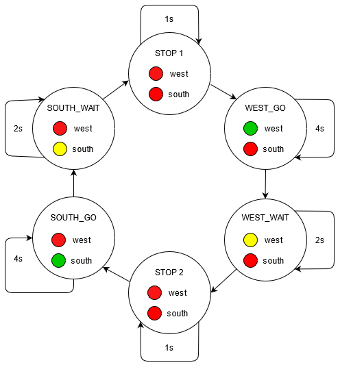
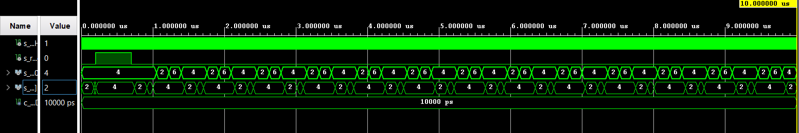
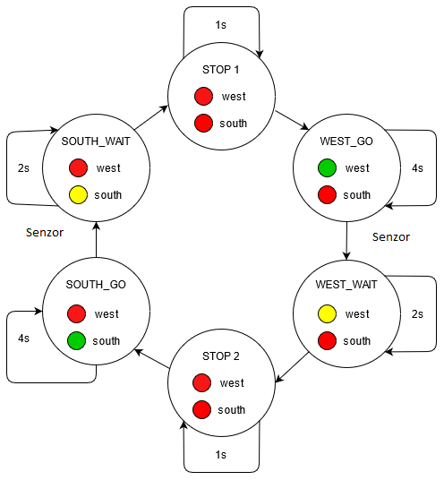

# Cvičení 8 - traffic lights

## Tabulky

| **Input P** | `0` | `0` | `1` | `1` | `0` | `1` | `0` | `1` | `1` | `1` | `1` | `0` | `0` | `1` | `1` | `1` |
| :-- | :-: | :-: | :-: | :-: | :-: | :-: | :-: | :-: | :-: | :-: | :-: | :-: | :-: | :-: | :-: | :-: |
| **Clock** | ↑ | ↑ | ↑ | ↑ | ↑ | ↑ | ↑ | ↑ | ↑ | ↑ | ↑ | ↑ | ↑ | ↑ | ↑ | ↑ |
| **State** | A | A | B | C | A | B | A | B | C | D | B | A | A | B | C | D |
| **Output R** | 0 | 0 | 0 | 0 | 0 | 0 | 0 | 0 | 0 | 1 | 0 | 0 | 0 | 0 | 0 | 1 |

## Tabulka pro zapojení LED

| **RGB LED** | **Artix-7 pin names** | **Red** | **Yellow** | **Green** |
| :-: | :-: | :-: | :-: | :-: |
| LD16 | N15, M16, R12 | 1,0,0 | 1,1,0 | 0,1,0 |
| LD17 | N16, R11, G14 | 1,0,0 | 1,1,0 | 0,1,0 |
## Semafor - diagram
<p align="center">

</p></br>

## VHDL kód sekvenční proces z `p_traffic_fsm`</br>

```vhdl
p_traffic_fsm : process(clk)
    begin
        if rising_edge(clk) then
            if (reset = '1') then       -- Synchronous reset
                s_state <= STOP1 ;      -- Set initial state
                s_cnt   <= c_ZERO;      -- Clear all bits

            elsif (s_en = '1') then
                -- Every 250 ms, CASE checks the value of the s_state 
                -- variable and changes to the next state according 
                -- to the delay value.
                case s_state is

                    -- If the current state is STOP1, then wait 1 sec
                    -- and move to the next GO_WAIT state.
                    when STOP1 =>
                        -- Count up to c_DELAY_1SEC
                        if (s_cnt < c_DELAY_1SEC) then
                            s_cnt <= s_cnt + 1;
                        else
                            -- Move to the next state
                            s_state <= WEST_GO;
                            -- Reset local counter value
                            s_cnt   <= c_ZERO;
                        end if;

                    when WEST_GO =>
                        if (s_cnt < c_DELAY_GO) then
                            s_cnt <= s_cnt + 1;
                        else
                            s_state <= WEST_WAIT;
                            s_cnt   <= c_ZERO;
                        end if;
                    
                    when WEST_WAIT =>
                        if (s_cnt < c_DELAY_WAIT) then
                            s_cnt <= s_cnt + 1;
                        else
                            s_state <= STOP2;
                            s_cnt   <= c_ZERO;
                        end if;
                        
                    when STOP2 =>
                        if (s_cnt < c_DELAY_1SEC) then
                            s_cnt <= s_cnt + 1;
                        else
                            s_state <= SOUTH_GO;
                            s_cnt   <= c_ZERO;
                        end if;
                    
                    when SOUTH_GO =>
                        if (s_cnt < c_DELAY_GO) then
                            s_cnt <= s_cnt + 1;
                        else
                            s_state <= SOUTH_WAIT;
                            s_cnt   <= c_ZERO;
                        end if;
                        
                    when SOUTH_WAIT =>
                        if (s_cnt < c_DELAY_GO) then
                            s_cnt <= s_cnt + 1;
                        else
                            s_state <= STOP1;
                            s_cnt   <= c_ZERO;
                        end if;                            

                    -- It is a good programming practice to use the 
                    -- OTHERS clause, even if all CASE choices have 
                    -- been made. 
                    when others =>
                        s_state <= STOP1;

                end case;
            end if; -- Synchronous reset
        end if; -- Rising edge
    end process p_traffic_fsm;
```
## VHDL kód kombinačního procesu z `p_output_fsm`

```vhdl
p_output_fsm : process(s_state)
    begin
        case s_state is
            when STOP1 =>
                south_o <= "100";   -- Red (RGB = 100)
                west_o  <= "100";   -- Red (RGB = 100)
            when WEST_GO =>
                south_o <= "100";
                west_o  <= "010";
            when WEST_WAIT =>
                south_o <= "100";
                west_o  <= "110";
            when STOP2 =>
                south_o <= "100";
                west_o  <= "100";
            when SOUTH_GO =>
                south_o <= "010";
                west_o  <= "100";
            when SOUTH_WAIT =>
                south_o <= "110";
                west_o  <= "100";
            when others =>
                south_o <= "100";   -- Red
                west_o  <= "100";   -- Red
        end case;
    end process p_output_fsm;
```
## Simulace semaforu


## Tabulka pro chytrý semafor

| **Current state** | **Direction South** | **Direction West** | **Delay** | **Senzor** |
| :-- | :-: | :-: | :-: | :-: |
| `STOP1`      | red    | red | 1 sec | NO |
| `WEST_GO`    | red    | green | 4 sec | YES |
| `WEST_WAIT`  | red    | yellow | 2 sec | NO |
| `STOP2`      | red    | red | 1 sec | NO |
| `SOUTH_GO`   | green  | red | 4 sec | YES |
| `SOUTH_WAIT` | yellow | red | 2 sec | NO |
## Diagram pro chytrý semafor
<p align="center">

</p></br>
