# Parking assistant with HC-SR04 ultrasonic sensor, sound signaling using PWM, signaling by LED bargraph

## Team members

- [Maroš Bilek](https://github.com/MarosBilek/Digital-electronics-1)
- [Radek Burian](https://github.com/Xxburia27/Digital-electronics-1)
- [Matúš Burčo](https://github.com/xburco00/Digital-electronics-1)
- [Bohumír Brhel](https://github.com/bobyx01/Digital-electronics-1)
- Adrián Bujna

## Project objectives

#### Project goal is to implement parking assistant with HC-SR04 ultrasonic sensor and LED bargraph onto board Arty A7-35T. Pulse width modulation(PWM) is used for sound signaling and LED baragraph for light signaling.


## Hardware description

### Choosen Components
 - Arty A7-35T
 - HC-SR04 ultrasonic sensor
 - LED bargraph
 - Buzzer
 - 5x Resistor 220Ω
 - Resistor 1000Ω
 - Resistor 2000Ω
 - 6x Transistor NPN
 - Voltage Source +5V

### Datasheets of used components

- [HC-SR04](https://cdn.sparkfun.com/datasheets/Sensors/Proximity/HCSR04.pdf)
- [LED baragraph](https://docs.broadcom.com/doc/5965-6545E)
- [Buzzer](http://www.electronicoscaldas.com/datasheet/LTE12-Series.pdf)
- [Resisitor](https://docs-emea.rs-online.com/webdocs/0e29/0900766b80e29d33.pdf)
- [Transistor NPN](https://www.onsemi.com/pdf/datasheet/2n3903-d.pdf)

### Board **Arty A7-35T**

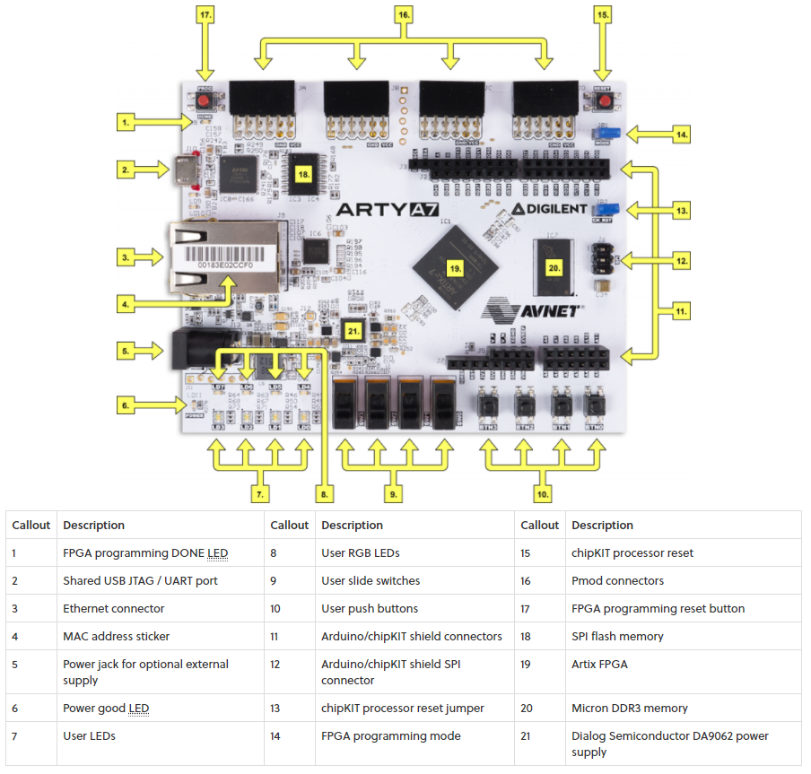

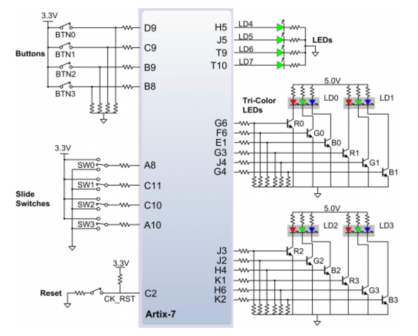

### Schematics of components connected on board Pins

#### HC-SR04
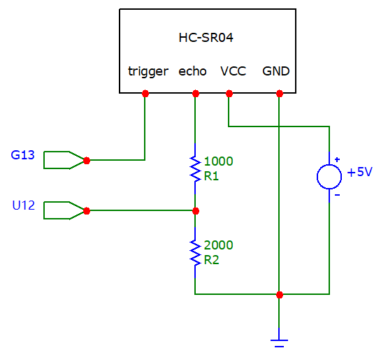

#### Buzzer
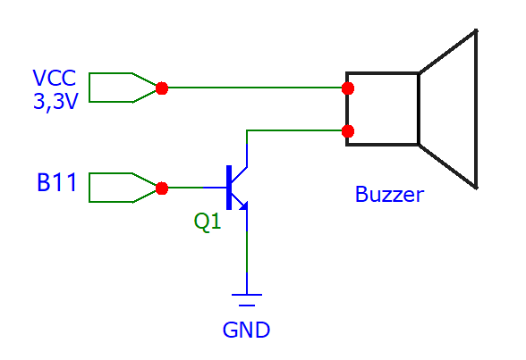

#### LED baragraph
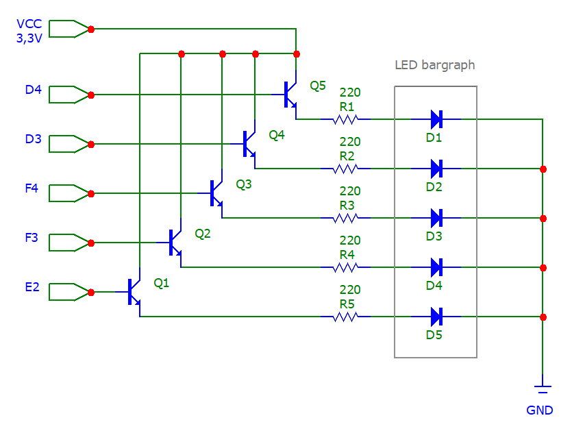

### Pmod connectors tables

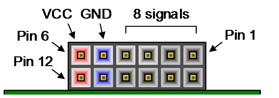

|| Pmod JA | Pmod JB | Pmod JC | Pmod JD |
| :-: | :-: | :-: | :-: | :-:|
| **Pmod Type** | **Standart** | **Hight-Speed** | **Hight-Speed** | **Standart** | 
| Pin 1  | G13 | E15 | U12 | D4 |
| Pin 2  | B11 | E16 | V12 | D3 |
| Pin 3  | A11 | D15 | V10 | F4 |
| Pin 4  | D12 | C15 | V11 | F3 |
| Pin 7  | D13 | J17 | U14 | E2 |
| Pin 8  | B18 | J18 | V14 | D2 |
| Pin 9  | A18 | K15 | T13 | H2 |
| Pin 10 | K16 | J15 | U13 | G2 |

#### Sensor HC-SR04 connection table
| **Sensor HC - SR04** | **Board - pmod** |
| :-: | :-: | 
| Trig | PIN1 - G13 |
| Echo | PIN1 - U12 |
| VCC | PIN6 -  VCC |
| GND | PIN5 - GND |

#### Buzzer connection table
| **Buzzer** | **Board - pmod** |
| :-: | :-: |
|Sound| PIN2 - B11 | 
| VCC | PIN12 - VCC |
| GND | PIN11 - GND |

#### LED bargraph connection table
| **LED bargraph** | **Board - JD_pmod** |
| :-: | :-: | 
| D1 | PIN1 - D4 |
| D2 | PIN2 - D3 |
| D3 | PIN3 -  F4 |
| D4 | PIN4 - F3 |
| D5 | PIN7 - E2 |
| GND | PIN5 - GND |
| VCC | PIN6 - VCC |


## VHDL modules description and simulations

### ```clock_enable.vhd``` modules
#### Modul clock_enable slúži na generovanie hodinového signálu. Modul clk_4khz je prerobený modul clock_enable aby generoval 4kHz. Aby sme g_MAX mohli meniť veľkosť, tak sme ju využili v port namiesto generic, ako to je v clock_enable.

#### Design module code for ```clock_enable.vhd```
```vhdl
library ieee;               
use ieee.std_logic_1164.all;
use ieee.numeric_std.all;   


entity clock_enable is
    generic(
       g_MAX : natural       -- Number of clk pulses to generate
                                   -- one enable signal period
            );  -- Note that there IS a semicolon between generic and port
                -- sections
    port(        
        clk   : in  std_logic;      -- Main clock
        reset : in  std_logic;      -- Synchronous reset
        ce_o  : out std_logic       -- Clock enable pulse signal
        );

end entity clock_enable;

------------------------------------------------------------------------
-- Architecture body for clock enable
------------------------------------------------------------------------
architecture behavioral of clock_enable is

    -- Local counter
    signal s_cnt_local : natural;

begin
    --------------------------------------------------------------------
    -- p_clk_ena:
    -- Generate clock enable signal. By default, enable signal is low 
    -- and generated pulse is always one clock long.
    --------------------------------------------------------------------
    p_clk_ena : process(clk)
    begin
        if rising_edge(clk) then        -- Synchronous process

            if (reset = '1') then       -- High active reset
                s_cnt_local <= 0;       -- Clear local counter
                ce_o        <= '0';     -- Set output to low

            -- Test number of clock periods
            elsif (s_cnt_local >= (g_MAX - 1)) then
                s_cnt_local <= 0;       -- Clear local counter
                ce_o        <= '1';     -- Generate clock enable pulse

            else
                s_cnt_local <= s_cnt_local + 1;
                ce_o        <= '0';
            end if;
        end if;
    end process p_clk_ena;

end architecture behavioral;
```

#### Design module code for ```clk_4khz.vhd```
```vhdl
library ieee;               
use ieee.std_logic_1164.all;
use ieee.numeric_std.all;   


entity clk_enable_beep is
    port(
            g_MAX : in  unsigned(18-1 downto 0);
            clk   : in  std_logic;      -- Main clock
            reset : in  std_logic;      -- Synchronous reset
            ce_o  : out std_logic       -- Clock enable pulse signal
        );
end entity clk_enable_beep;

------------------------------------------------------------------------
-- Architecture body for clock enable
------------------------------------------------------------------------
architecture behavioral of clk_enable_beep is

    -- Local counter
    signal s_cnt_local : natural;

begin
    --------------------------------------------------------------------
    -- p_clk_ena:
    -- Generate clock enable signal. By default, enable signal is low 
    -- and generated pulse is always one clock long.
    --------------------------------------------------------------------
    p_clk_ena : process(clk)
    begin
        if rising_edge(clk) then        -- Synchronous process

            if (reset = '1') then       -- High active reset
                s_cnt_local <= 0;       -- Clear local counter
                ce_o        <= '0';     -- Set output to low

            -- Test number of clock periods
            elsif (s_cnt_local >= (g_MAX - 1)) then 
                s_cnt_local <= 0;       -- Clear local counter
                ce_o        <= '1';     -- Generate clock enable pulse

            else
                s_cnt_local <= s_cnt_local + 1;
                ce_o        <= '0';
            end if;
        end if;
    end process p_clk_ena;

end architecture behavioral;
```


### ```pwm.vhd```
#### Modul pwm využíva zjednodušenú Impulzovú šírkovú moduláciu(PWM). Pomocou 4kHz sa generuje zvuk. Signál s_en funguje na princípe flip_flop pre výstupný signál sound ktorý mení dĺžku pípania pomocou g_MAX_lenght a počtu s_echou_count.

#### Design module code
```vhdl
library IEEE;
use IEEE.STD_LOGIC_1164.ALL;
use IEEE.NUMERIC_STD.ALL;


entity pwm is
    Port (           
            sound        : out STD_LOGIC;
            clock        : in STD_LOGIC;
            reset        : in std_logic;
            echo_count_i : in unsigned(16 - 1 downto 0)
         );
end pwm;

architecture Behavioral of pwm is
    signal s_4khz       : std_logic;
    signal s_en         : std_logic;
    signal s_sound      : std_logic := '0';
    signal g_MAX_length : unsigned(18-1 downto 0) := b"11_0110_1110_1110_1000"; -- 225 000
begin

    clk_en0 : entity work.clock_enable
       generic map(g_MAX => 25000
       )
            port map
            (
                clk   => clock,
                reset => reset,
                ce_o  => s_4khz          
            );
            
     clk_en1 : entity work.clk_enable_beep
       
            port map
            (
                clk   => clock,
                reset => reset,
                ce_o  => s_en,
                g_MAX => g_MAX_length
            );       
            
                       
p_sound : process (clock)
 begin
    if rising_edge (clock) then
        if(reset = '1') then
            s_sound <= '0';
        else
            if(s_en = '1') then
            s_sound <= not s_sound;
            else
                s_sound <=  s_sound;
            end if;
        end if;
    end if;
        end process p_sound;
        
p_decide : process(clock)
begin
    if(echo_count_i > 0 and echo_count_i < 1166) then
        g_MAX_length <= b"01_1000_0110_1010_0000";      --100 000
 
    elsif(echo_count_i > 1166 and echo_count_i < 2332)then
        g_MAX_length <=b"01_1110_1000_0100_1000";       --125 000
 
    elsif(echo_count_i > 2332 and echo_count_i < 3499) then
        g_MAX_length <=b"10_0100_1001_1111_0000";       --150 000
 
    elsif(echo_count_i > 3499 and echo_count_i < 4664)then
        g_MAX_length <=b"10_1010_1011_1001_1000";       --175 000
 
    elsif(echo_count_i > 4664 and echo_count_i < 5831)then
        g_MAX_length <=b"11_0000_1101_0100_0000";       --200 000
 
    else
        g_MAX_length <=b"11_0110_1110_1110_1000";       --225 000
    
    end if;
end process p_decide;       
        sound <= s_sound and s_4khz;
        
end Behavioral;
```

#### Testbench code
```vhdl
library IEEE;
use IEEE.STD_LOGIC_1164.ALL;
use IEEE.NUMERIC_STD.ALL;

entity tb_pwm is

end tb_pwm;

architecture Behavioral of tb_pwm is

    constant c_CLK_100MHZ_PERIOD : time := 10ns;
    signal s_sound : std_logic;
    signal s_clock : std_logic;
    signal s_reset : std_logic;
    signal s_echo_count_i : unsigned(16-1 downto 0);
   

begin

uut : entity work.pwm

port map(  
           sound        => s_sound,
           clock        => s_clock,
           echo_count_i => s_echo_count_i,
           reset        => s_reset
        );

p_clk_gen : process
begin
    while now < 100000 us loop
        s_clock <= '0';
        wait for c_CLK_100MHZ_PERIOD / 2;
        s_clock <= '1';
        wait for c_CLK_100MHZ_PERIOD / 2;
    end loop;
    wait;
end process p_clk_gen;    
                
p_stimulus : process
begin
    s_reset <= '1';
    wait for 300 us;
    
    s_reset<= '0';
    wait for 4ms ;
    
    s_echo_count_i <= b"0000_0000_0011_0111";
    wait for 5ms;

    s_echo_count_i <= b"0000_0000_0000_1111";
    wait for 5ms;

    s_echo_count_i <= b"0000_0000_0101_0100";
    wait for 5ms;
    
    s_echo_count_i <= b"0000_0000_0000_0110";
    wait for 5ms;
    
    s_echo_count_i <= b"0000_0000_0011_0011";
    wait for 5ms;

    s_echo_count_i <= b"0000_0000_0000_1100";
    wait for 5ms;

    s_echo_count_i <= b"0000_0000_0111_0100";
    
    wait;
    
end process p_stimulus;

end Behavioral;
```

#### Screenshot with simulated time waveforms
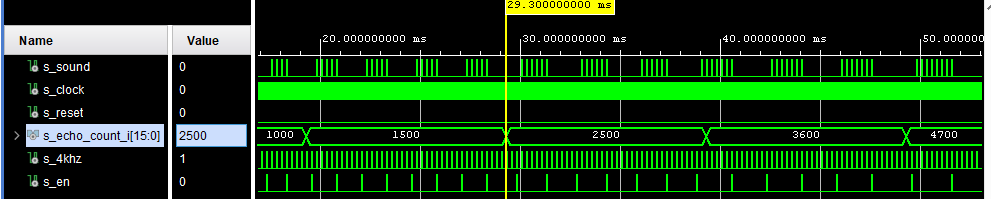


### ```LED_baragraph.vhd```
#### V module LED_baragraph sa využíva s_echo_count_o z modulu state_machine  a prevádza sa na echo_count_i . Následne sa echo_count_i využíva ako rozmedzie pre použité LED diody, ktoré sú používané na baragrafe.  Pomocou vzorca prevádzame čas, ktorý sa odrazí od steny na vzdialenosť. Rozmedzie v čase je uvedené v procese p_decide. Použitý vzorec: D = (tt/2 * Cv) ... D - distance; tt - time travel; Cv - rýchlosť zvuku (0,0343m*s-1)

#### Table of LED light diodes
|  Range[Cm]  |  LED  |
| :-: | :-: |
| 0 - 20 | 11111 | 
| 20 - 40 | 11110 |
| 40 - 60 | 11100 | 
| 60 - 80 | 11000 |
| 80 - 100 | 10000 |
| 100 < | 00000 |

#### Design module code
```vhdl
library IEEE;
use IEEE.STD_LOGIC_1164.ALL;
use ieee.numeric_std.all;

entity LED_bargraph is
Port ( 
        clk          : in  std_logic;
        reset        : in  std_logic;
        led_o        : out std_logic_vector(4 downto 0);
        echo_count_i : in unsigned(16 - 1 downto 0)
     );
end LED_bargraph;

architecture Behavioral of LED_bargraph is

signal s_echo_count : unsigned(16-1 downto 0);
signal s_en         : std_logic;

begin

clk_en0 : entity work.clock_enable
        generic map(
                      g_MAX =>  100      
                   )
        port map(
                    clk   => clk,
                    reset => reset,
                    ce_o  => s_en
                );

p_decide : process(clk)
begin

    if(echo_count_i > 0 and echo_count_i < 1166) then 
        led_o (4 downto 0 ) <= "11111";
    elsif(echo_count_i > 1166 and echo_count_i < 2332)then 
        led_o (4 downto 0 ) <= "11110"; 
    elsif(echo_count_i > 2332 and echo_count_i < 3499) then
        led_o (4 downto 0 ) <= "11100";
    elsif(echo_count_i > 3499 and echo_count_i < 4664)then 
        led_o (4 downto 0 ) <= "11000";
    elsif(echo_count_i > 4664 and echo_count_i < 5831)then   
        led_o (4 downto 0 ) <= "10000";
    else   
        led_o (4 downto 0 ) <= "00000";
    end if;
end process p_decide; 

end Behavioral;
```

#### Testbench code
```vhdl
library IEEE;
use IEEE.STD_LOGIC_1164.ALL;

-- Uncomment the following library declaration if using
-- arithmetic functions with Signed or Unsigned values
use IEEE.NUMERIC_STD.ALL;

-- Uncomment the following library declaration if instantiating
-- any Xilinx leaf cells in this code.
--library UNISIM;
--use UNISIM.VComponents.all;

entity tb_LED_bargraph is

end tb_LED_bargraph;

architecture Behavioral of tb_LED_bargraph is
   constant c_CLK_4kHZ_PERIOD : time := 10ns;
   signal s_clk               : std_logic;
   signal s_reset             : std_logic;
   signal s_led_o             : std_logic_vector(4 downto 0);
   signal s_echo_count_i      : unsigned(16 - 1 downto 0);

begin

uut_ledky : entity work.LED_bargraph
    port map(
                led_o           => s_led_o,
                reset           => s_reset,
                clk             => s_clk,
                echo_count_i    => s_echo_count_i
            );

p_clk_gen : process
    begin
        while now < 200 ms loop   -- 10 usec of simulation
            s_clk <= '0';
            wait for c_CLK_4kHZ_PERIOD / 2;
            s_clk <= '1';
            wait for c_CLK_4kHZ_PERIOD / 2;
        end loop;
        wait;
    end process p_clk_gen;

p_led : process
begin
    s_echo_count_i <= b"0000_1011_1011_1000";--count = 3000
    wait for 25us;                           -- led = (11100) - 3 LEDs are ON
    assert (s_led_o = "11100") report "Error for count 3000" severity error;  
     
    s_echo_count_i <= b"0001_0011_1000_1000";--count = 5000
    wait for 25us;                           -- led = (10000) - 1 LEDs are ON
    assert (s_led_o = "10000") report "Error for count 5000" severity error;
    
    s_echo_count_i <= b"0000_0111_1101_0000";--count = 2000
    wait for 25us;                           -- led = (11110) - 4 LEDs are ON
    assert (s_led_o = "11110") report "Error for count 2000" severity error;
    
    s_echo_count_i <= b"0000_0000_0000_1111";-- count = 15
    wait for 25us;                           -- led = (11111) - 5 LEDs are ON
    assert (s_led_o = "11111") report "Error for count 15" severity error;
    
    s_echo_count_i <= b"0000_1111_1010_0000";-- count = 4000
    wait for 25us;                           -- led = (11000) - 2 LEDs are ON
    assert (s_led_o = "11000") report "Error for count 4000" severity error;
    
    s_echo_count_i <= b"0000_0000_0000_0000";-- count = 0
    wait ;                                   -- led = (00000) - 0 LEDs are ON
    assert (s_led_o = "00000") report "Error for count 0" severity error;
    
    end process p_led;
end Behavioral;
```

#### Screenshot with simulated time waveforms
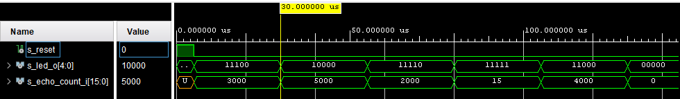


### ```state_machine.vhd```
#### Modul state_machine je založený na stavovom diagrame. V tomto module určujeme štyri základné stavy (DEFAULT, trig_send, trig_wait, echo_counter). Prvý stav je výstupný, kedy nie je aktívna spiatočka(reverse). Pri zaradení spiatočky sa prepne do stavu trig_send a vyšle trigger. Po vyslaní trigerru sa dostaneme do stavu trig_wait, v ktorom čakáme na echo. V prípade obdržania echa sa dostaneme do echo_counter a začne sa čítať čas. Následne sa smeruje do stavu trig_send. V každom stave je braná možnosť spiatočky.

#### State Diagram
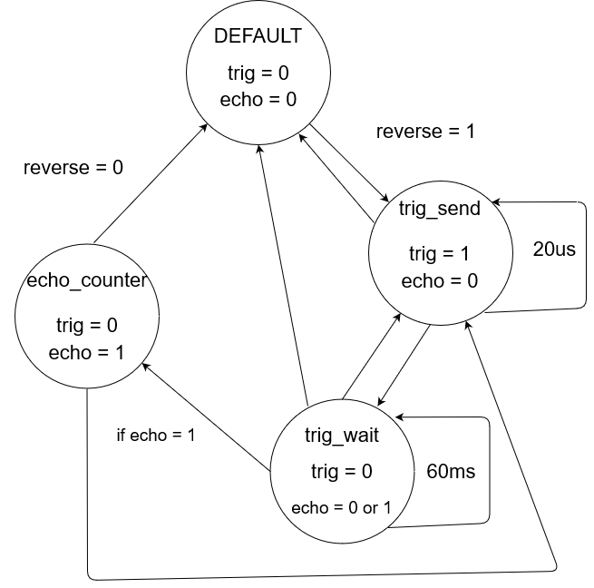

#### Design module code
```vhdl
library IEEE;
use IEEE.STD_LOGIC_1164.ALL;
use ieee.numeric_std.all;


entity state_machine is
 Port (
        clk       : in  std_logic;
        reset     : in  std_logic;
        
        echo_i    : in  std_logic_vector(0 downto 0);
       
        -- OUTPUTS
        echo_count_o : out unsigned(16 - 1 downto 0);
        trigger_o : out std_logic
        
      );
end state_machine;

architecture Behavioral of state_machine is
-- Define the states
    type t_state is ( DEF,          --default
                      TRIGG_SEND,   -- trig_send
                      TRIGG_WAIT,   -- trigg_wait
                      ECHO_COUNT    --echo_count
                     );
                     
    -- Define the signal that uses different states
    signal s_state  : t_state;
    -- Internal clock enable
    signal s_en     : std_logic;
    -- Local delay counter
    signal   s_cnt  : unsigned(18 - 1 downto 0);
    -- Local echo counter
    signal   s_cnt_echo  : unsigned(16 - 1 downto 0)  := b"0000_0000_0000_0000"; 
    
    signal s_reverse : std_logic := '1';
    -- Specific values for local counter
    constant c_ZERO         :    unsigned(18 - 1 downto 0)  := b"00_0000_0000_0000_0000";
    constant c_DELAY_20uSEC :    unsigned(18 - 1 downto 0)  := b"00_0000_0000_0001_0100";   --20us  
    constant c_DELAY_60mSEC :    unsigned(18 - 1 downto 0)  := b"001_1101_0100_1100_000";   --60ms  
    
    
begin

    
    clk_en0 : entity work.clock_enable
        generic map(
                        g_MAX =>  100      
                   )
        port map(
                    clk   => clk,
                    reset => reset,
                    ce_o  => s_en
                );

   
    p_fsm : process(clk)
    begin
        if rising_edge(clk) then        -- 1 clk = 10 ns
            if (reset = '1') then       -- Synchronous reset
                s_state <= DEF ;        -- Set initial state
                s_cnt   <= c_ZERO;      -- Clear all bits
            elsif (s_en = '1') then
                -- Every 1 us, CASE checks the value of the s_state 
                -- variable and changes to the next state according 
                -- to the delay value.
                case s_state is
                    -- If the current state is DEF                   
                    when DEF =>
                        -- Count up to c_DELAY_20uSEC
                        echo_count_o <=(others => '0');         
                        if (s_reverse = '0' ) then
                            trigger_o <= '0';
                        else
                            -- Move to the next state
                            s_state <= TRIGG_SEND;
                            -- Reset local counter value
                            s_cnt   <= c_ZERO;                            
                        end if;

                    when TRIGG_SEND =>                      
                        if (s_cnt < c_DELAY_20uSEC) then                       
                            trigger_o <= '1';
                            s_cnt <= s_cnt + 1;
                        else
                            s_state <= TRIGG_WAIT;
                            s_cnt   <= c_ZERO;
                        end if;
                        
                    when TRIGG_WAIT =>
                        
                        if(s_reverse = '0') then
                               s_state <= DEF;
                               s_cnt   <= c_ZERO;
                        else                              
                            if (s_cnt < c_DELAY_60mSEC) then
                                trigger_o <= '0';
                                s_cnt <= s_cnt + 1;
                                if(echo_i = "1") then
                                    s_cnt_echo <= (others => '0');
                                    s_state <= ECHO_COUNT;                                   
                                end if;    
                            else
                                s_state <= TRIGG_SEND;
                                s_cnt   <= c_ZERO;
                            end if;
                        end if;
                        
                    when ECHO_COUNT =>   
                                                 
                        if(s_reverse = '0') then
                               s_state <= DEF;
                               s_cnt   <= c_ZERO;
                        else                             
                            if(echo_i = "1") then                                                
                                s_cnt_echo <= s_cnt_echo + 1;  -- 1 count = 1 us                                                          
                            else
                            echo_count_o <= s_cnt_echo;                 
                            s_state <= TRIGG_SEND;
                            s_cnt   <= c_ZERO; 
                            end if;                            
                        end if;   
                    when others =>
                        s_state <= DEF;                       
                end case;
            end if; -- Synchronous reset
        end if; -- Rising edge
    end process p_fsm;
end Behavioral;
```

#### Testbench code
```vhdl
library IEEE;
use IEEE.STD_LOGIC_1164.ALL;
use ieee.numeric_std.all;


entity tb_state_machine is

end tb_state_machine;

architecture Behavioral of tb_state_machine is

  constant c_CLK_100MHZ_PERIOD : time := 10ns;
  
  signal      s_clk_100MHz     :   std_logic;
  signal      s_reset          :   std_logic;
  signal      s_reverse        :   std_logic := '1';      
  signal      s_echo_i         :   std_logic_vector (0 downto 0);
  signal      s_trigger_o      :   std_logic;
  signal      s_echo_count_o   :   unsigned(16 - 1 downto 0)  := b"0000_0000_0000_0000";


begin

uut : entity work.state_machine
 port map(
        clk          => s_clk_100MHz,
        reset        => s_reset,        
        echo_i       => s_echo_i,
        trigger_o    => s_trigger_o,     
        echo_count_o => s_echo_count_o 
        
  );
  
  
    --------------------------------------------------------------------
    -- Clock generation process
    --------------------------------------------------------------------
    p_clk_gen : process
    begin
        while now < 200 ms loop   -- 10 usec of simulation
            s_clk_100MHz <= '0';
            wait for c_CLK_100MHZ_PERIOD / 2;
            s_clk_100MHz <= '1';
            wait for c_CLK_100MHZ_PERIOD / 2;
        end loop;
        wait;
    end process p_clk_gen;


    --------------------------------------------------------------------
    -- Reset generation process
    --------------------------------------------------------------------
    p_reset_gen : process
    begin
        s_reset <= '0'; wait for 5 us;
        -- Reset activated
        s_reset <= '1'; wait for 5 us;
        -- Reset deactivated
        s_reset <= '0';
        wait;
    end process p_reset_gen;

    --------------------------------------------------------------------
    -- Data generation process
    --------------------------------------------------------------------
    p_stimulus : process
    begin
       wait for 23 us;
       s_echo_i(0) <= '1';
       
       wait for 100 us;
       s_echo_i(0) <= '0';
       
       wait for 23 us;
       s_echo_i(0) <= '1';
            
       wait for 200 us;
       s_echo_i(0) <= '0';
              
       wait;
    end process p_stimulus;
    
end Behavioral;
```

#### Screenshots with simulated time waveforms
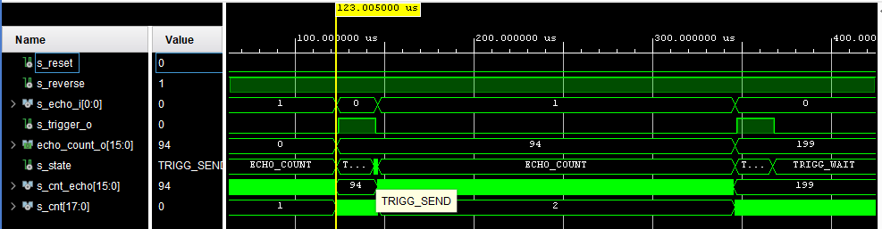


## TOP module description and simulations
#### Modul TOP je využitý na implementáciu všetkých modulov na dosku Arty A7-35T. Pomocou constraints sme priradili vstupy a výstupy z vytvorených modulov priradili k PINom dosky.

### Schematic of TOP
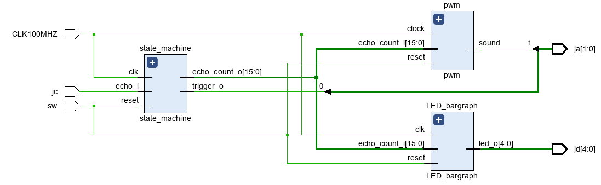

### Design module code
```vhdl
library IEEE;
use IEEE.STD_LOGIC_1164.ALL;
use ieee.numeric_std.all;


entity top is
  Port (
           CLK100MHZ : in STD_LOGIC;                       --clock
           sw   : in std_logic_vector(0 downto 0);         -- reset switch
           --outputs
           jd : out STD_LOGIC_VECTOR (4 downto 0);         --LEDs
           ja : out std_logic_vector (1 downto 0);         -- ja(0) -> trigger_o;  ja(1) -> sound
           --input (echo_i)
           jc : in std_logic_vector(0 downto 0)     
       );
end top;

architecture Behavioral of top is

signal s_echo_count : unsigned(16 - 1 downto 0);

begin

    state_machine : entity work.state_machine
        port map(
                    clk     => CLK100MHZ,
                    reset   => sw(0),
                    echo_i  => jc,      
                    echo_count_o => s_echo_count,
                    trigger_o => ja(0)
                );
        
    pwm : entity work.pwm
        port map(
                    sound  => ja(1),  
                    clock  => CLK100MHZ,
                    reset  => sw(0),  
                    echo_count_i => s_echo_count
                );
    
    LED_bargraph : entity work.LED_bargraph
        port map(
                    clk          => CLK100MHZ, 
                    reset        => sw(0), 
                    led_o        => jd(4 downto 0),
                    echo_count_i => s_echo_count
                );

end Behavioral;
```

### Testbench code
```vhdl
library IEEE;
use IEEE.STD_LOGIC_1164.ALL;

entity tb_top is

end tb_top;

architecture Behavioral of tb_top is
constant         c_CLK_100MHZ_PERIOD :  time := 10ns;
signal           s_CLK100MHZ         :  STD_LOGIC;                      --clock
signal           s_sw                :  std_logic_vector(0 downto 0);   -- reset switch
           --outputs
signal           s_jd                :  STD_LOGIC_VECTOR (4 downto 0);  --LEDs
signal           s_ja                :  std_logic_vector (1 downto 0);  -- ja(0) -> trigger_o;  ja(1) -> sound
           --input (echo_i)
signal           s_jc                :  std_logic_vector(0 downto 0);


begin

    --------------------------------------------------------------------
    -- Clock generation process
    --------------------------------------------------------------------
    p_clk_gen : process
    begin
        while now < 200 ms loop   -- 10 usec of simulation
            s_CLK100MHz <= '0';
            wait for c_CLK_100MHZ_PERIOD / 2;
            s_CLK100MHz <= '1';
            wait for c_CLK_100MHZ_PERIOD / 2;
        end loop;
        wait;
    end process p_clk_gen;


uut_top : entity work.top
    port map(
                CLK100MHZ =>s_CLK100MHZ,
                sw(0)        => s_sw(0),
                jd        =>s_jd,
                ja        =>s_ja,
                jc(0)       =>s_jc(0) 
            );

p_top : process
begin

 wait for 10 ms;
 s_sw(0) <= '1';
 wait for 2 ms;
 s_sw(0) <= '0';
 wait for 5 ms;
 s_jc(0) <= '1';
 wait for 5ms;
 s_jc(0) <= '0';
 wait for 4ms;
 s_jc(0) <= '1';
 wait for 2ms;
 s_jc(0) <= '0';
 wait;
end process p_top;

end Behavioral;
```

#### Screenshot with simulated time waveforms
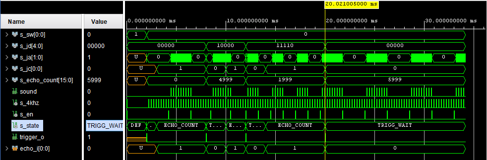


## Video
 [Video for the presentation of the project]()
